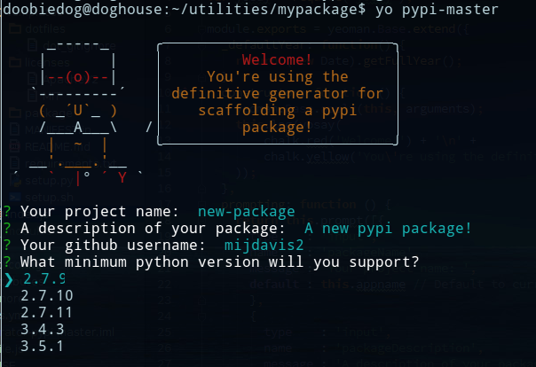

[![NPM version][npm-image]][npm-url] [![Dependency Status][daviddm-image]][daviddm-url]

# generator-pypi-master 

> A complete pypi package generator



Generate a new custom pypi package in seconds.

There are other pypi generators out there 
but they are either incomplete or do literally nothing.
This one creates a nice customized standard pypi package 
in a user friendly way.

**BONUS**: includes a setup script for easy virtualenv setup.

## Installation

First, install [Yeoman](http://yeoman.io) and generator-pypi-master using [npm](https://www.npmjs.com/) (we assume you have pre-installed [node.js](https://nodejs.org/)).

```bash
npm install -g yo
npm install -g generator-pypi-master
```

Then generate your new project:

```bash
yo pypi-master
```

## Generated File Tree

```
package
|-- .github
|    |-- CONTRIBUTING.md
|    |-- ISSUE_TEMPLATE.md
|    |-- PULL_REQUEST_TEMPLATE.md
|-- package
|    |-- __init.py__
|    |-- core.py
|    |-- tests
|        |-- __init__.py
|-- LICENSE 
|-- MANIFEST.in
|-- README.md
|-- requirements.txt
|-- setup.py 
|-- setup.sh
```

## License

MIT © [mijdavis2](https://mdavis.io)


[npm-image]: https://badge.fury.io/js/generator-pypi-master.svg
[npm-url]: https://npmjs.org/package/generator-pypi-master
[travis-image]: https://travis-ci.org/mijdavis2/generator-pypi-master.svg?branch=master
[travis-url]: https://travis-ci.org/mijdavis2/generator-pypi-master
[daviddm-image]: https://david-dm.org/mijdavis2/generator-pypi-master.svg?theme=shields.io
[daviddm-url]: https://david-dm.org/mijdavis2/generator-pypi-master
